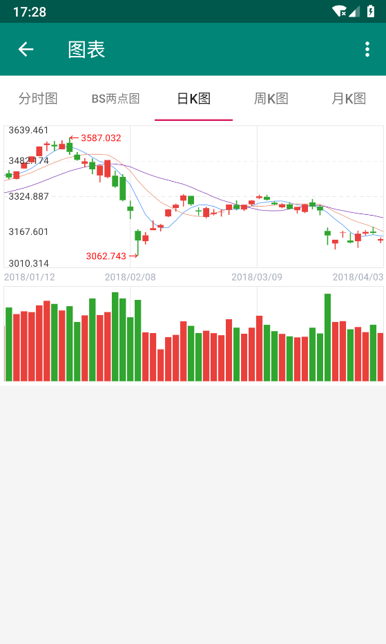
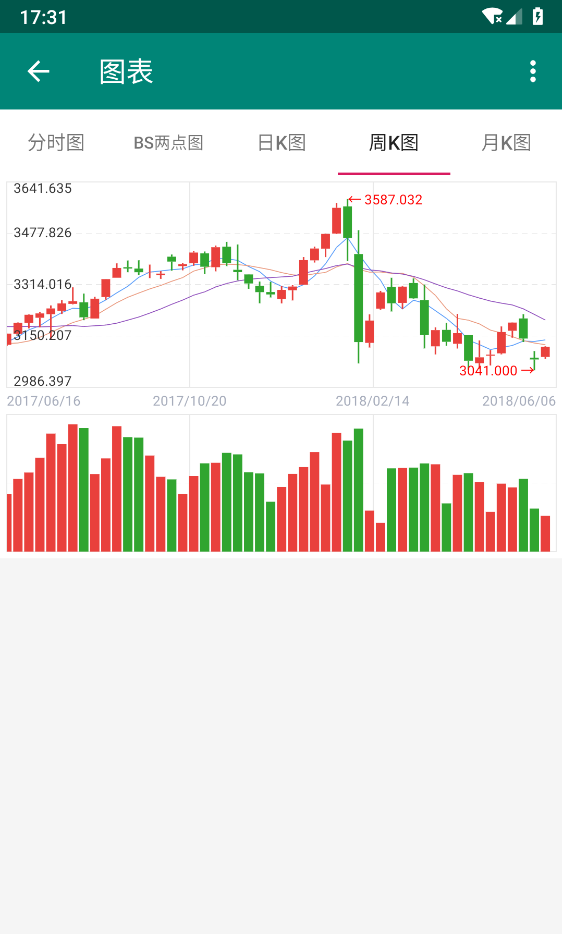
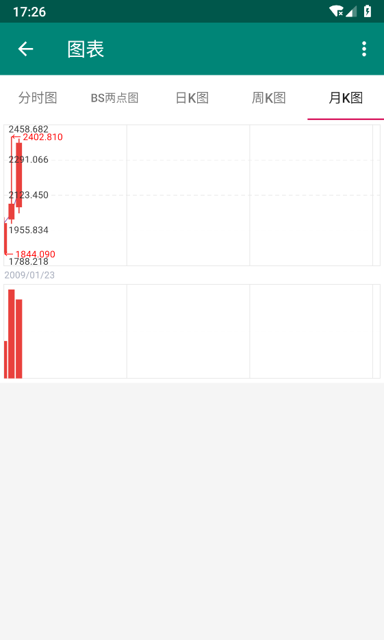

# X-StockChart

**基于MPAndroidChart3.0+的专业分时图和K线图**
```
allprojects {
    repositories {
        google()
        jcenter()
        maven { url 'https://dl.bintray.com/weixia/maven' }
    }
}

implementation 'me.xia:x-stockchart:3.1.2'
```

先上效果图：








## 简介

### 参考 [StockChart](https://github.com/WallaceXiao/StockChart-MPAndroidChart) 实现项目中需要的分时图、K线图等图表

StockApp是Android平台的金融图表库，包括**分时图**和**K线图**。本项目通过继承的方式定制了最新版本的**MPAndroidChart**

- 使用简单，几行代码就可以实现专业分时K线图效果
- 支持BS（买卖）两点分时图
- 支持五日的分时图
- 支持MACD、KDJ、RSI、SAR、BOLL、CCI、MA、SMA、EXPMA、KMA等指标的显示和切换
- 支持K线图左右滑动加载更多数据
- 支持图表的缩放，可以进行放大和缩小操作
- 支持刻度值画在图表内侧和外侧，可自由定制
<!--- 分时图增加最近一点的数值闪动显示并在右侧画出最新价数值-->
